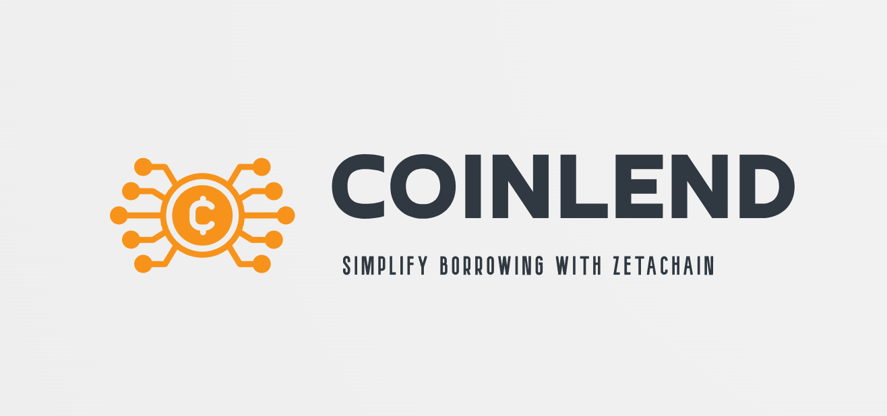
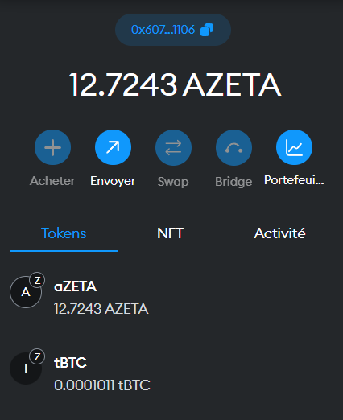

## Project short bio

We will make lending and borrowing protocols that let you lend/borrow native Bitcoin

## Project long description

Details

Coinlend is a groundbreaking financial ecosystem designed to revolutionize the way users interact with digital assets by seamlessly bridging the gap between ZetaChain and Bitcoin. Our mission is to simplify borrowing and lending in the world of cryptocurrency, making it accessible to everyone.

In a landscape where blockchain ecosystems often operate in silos, Coinlend acts as a bridge, allowing users to effortlessly transfer their Bitcoin holdings to ZetaChain and tap into the vast array of opportunities it offers. We envision a future where the power of ZetaChain's omnichain capabilities and generic smart contracts can be harnessed by anyone, regardless of their blockchain preferences.

Our lending and borrowing protocols are at the core of Coinlend's innovation. By enabling users to lend and borrow native Bitcoin within the ZetaChain environment, we unlock a new realm of possibilities for both experienced crypto enthusiasts and newcomers alike.

Key features of Coinlend:

- Seamless Asset Transfer: Coinlend simplifies the process of moving Bitcoin to ZetaChain, eliminating the complexities often associated with cross-chain transactions.

- Lending Opportunities: Users can become lenders and earn passive income by providing their Bitcoin assets for lending within the ZetaChain ecosystem.

- Borrowing Convenience: Borrowers gain access to much-needed liquidity by leveraging their assets on ZetaChain as collateral to secure Bitcoin loans.

- User-Friendly Interface: We prioritize user experience, ensuring that both lending and borrowing processes are straightforward and intuitive.

- Security and Trust: Coinlend employs robust security measures to safeguard users' assets and maintain the highest level of trust within the platform.

Coinlend is more than just a financial platform; it's a gateway to the future of blockchain finance. As we continue to develop our prototype and expand our services, we aim to empower users to make the most of the crypto ecosystem, whether they are interested in DeFi, payments, art, games, or other blockchain applications.

Join us on this exciting journey to simplify borrowing with ZetaChain. Together, we'll unlock the potential of a fluid, multi-chain crypto ecosystem, where financial opportunities are truly limitless. Coinlend is not just a project; it's a movement towards a more inclusive and accessible blockchain world.

## Links

- [Buildbox](https://app.buidlbox.io/projects/coinlend)

- [Deployed](https://coinlend.vercel.app/)

- [Zetachain](https://www.zetachain.com/)

- [ZetaScan](https://explorer.zetachain.com/)

## addresses

tBTC : tss tb1qy9pqmk2pd9sv63g27jt8r657wy0d9ueeh0nqur

### info dev

send 200 Satoshi to Zetachain:

https://blockstream.info/testnet/tx/f4811ede895c33bfe2f1a4a535bd53c726a697c1d856713477c23910e9557aad

https://blockchair.com/bitcoin/testnet/transaction/f4811ede895c33bfe2f1a4a535bd53c726a697c1d856713477c23910e9557aad

tx on Zetachain on my dev wallet:

https://explorer.zetachain.com/address/0x607Ec1a7F093801b40DaE21131dDAdB8ce991106

https://explorer.zetachain.com/evm/tx/

result : Ireceive wBTC on Zetachain to enter in my lending and borrowing

